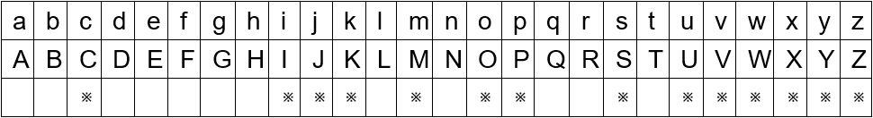

# k-means Clustering
## Problem Setup
The EMNIST’s letters database is a dataset of handwritten letters, comprising 124800 training
examples and 20800 test examples. In this question, we will implement the k-means algorithm using EMNIST’s letters dataset. The data can be downloaded at begining page. The EMNIST letters data set contains 26 various letters(with both uppercase and lowercase). Each of the letters is a 28x28 pixel image, resulting in a 784-dimensional space. The training set contains two files:
- *emnist-letters-train-images-idx3-ubyte :* training set images (97843216 bytes)
  
  *Contains the training image instances. Rows are images and columns are pixels with values from 0 to 255.*

- *emnist-letters-train-labels-idx1-ubyte :* training set labels (124808 bytes)
  
  *Contains the true labels of training images.*

And the testing set contains the following 2 files:
- *emnist-letters-test-images-idx3-ubyte :* testing set images (16307216 bytes)
  
  *Contains the testing image instances.*

- *emnist-letters-test-labels-idx1-ubyte :* testing set labels (20808 bytes)
  
  *Contains the true labels of testing images.*

Note that they are binary files and the dataset structure matches the [MNIST dataset](http://yann.lecun.com/exdb/mnist/). You can get detailed information of the data from [here](
https://www.nist.gov/itl/products-and-services/emnist-dataset/) and the [paper](https://arxiv.org/pdf/1702.05373v1.pdf).
## Decode ubyte File to txt File
```python
import numpy as np
import struct
import random

train_images_idx3_ubyte_file = './emnist-letters-train-images-idx3-ubyte'
train_labels_idx1_ubyte_file = './emnist-letters-train-labels-idx1-ubyte'

test_images_idx3_ubyte_file = './emnist-letters-test-images-idx3-ubyte'
test_labels_idx1_ubyte_file = './emnist-letters-test-labels-idx1-ubyte'


def decode_idx3_ubyte(idx3_ubyte_file):

    bin_data = open(idx3_ubyte_file, 'rb').read()

    offset = 0
    fmt_header = '>iiii'
    magic_number, num_images, num_rows, num_cols = struct.unpack_from(fmt_header, bin_data, offset)
    print('magic number:%d, image #: %d, image size: %d*%d' % (magic_number, num_images, num_rows, num_cols))

    image_size = num_rows * num_cols
    offset += struct.calcsize(fmt_header)
    fmt_image = '>' + str(image_size) + 'B'
    images = np.empty((num_images, num_rows, num_cols))
    for i in range(num_images):
        if (i + 1) % 10000 == 0:
            print('Finish %d' % (i + 1))
        images[i] = np.array(struct.unpack_from(fmt_image, bin_data, offset)).reshape((num_rows, num_cols))
        offset += struct.calcsize(fmt_image)
    return images


def decode_idx1_ubyte(idx1_ubyte_file):
    
    bin_data = open(idx1_ubyte_file, 'rb').read()

    offset = 0
    fmt_header = '>ii'
    magic_number, num_images = struct.unpack_from(fmt_header, bin_data, offset)
    print('magic number:%d, image #: %d' % (magic_number, num_images))

    offset += struct.calcsize(fmt_header)
    fmt_image = '>B'
    labels = np.empty(num_images)
    for i in range(num_images):
        if (i + 1) % 10000 == 0:
            print('Finish %d' % (i + 1))
        labels[i] = struct.unpack_from(fmt_image, bin_data, offset)[0]
        offset += struct.calcsize(fmt_image)
    return labels


def load_train_images(idx_ubyte_file=train_images_idx3_ubyte_file):
    return decode_idx3_ubyte(idx_ubyte_file)


def load_train_labels(idx_ubyte_file=train_labels_idx1_ubyte_file):
    return decode_idx1_ubyte(idx_ubyte_file)


def load_test_images(idx_ubyte_file=test_images_idx3_ubyte_file):
    return decode_idx3_ubyte(idx_ubyte_file)


def load_test_labels(idx_ubyte_file=test_labels_idx1_ubyte_file):
    return decode_idx1_ubyte(idx_ubyte_file)

train_images = load_train_images()
train_labels = load_train_labels()
test_images = load_test_images()
test_labels = load_test_labels()

train_images_txt = []
for i in train_images:
    train_images_txt.append(i.flatten())
train_labels_txt = []
for i in train_labels:
    train_labels_txt.append(i.flatten())
test_images_txt = []
for i in test_images:
    test_images_txt.append(i.flatten())
test_labels_txt = []
for i in test_labels:
    test_labels_txt.append(i.flatten())

centroid = []
for i in range(38):
    centroid.append(random.randint(0,len(train_images_txt)))

with open("train_image.txt","w") as f:
    for i in range(len(train_images_txt)):
        data = str(list(train_images_txt[i])).strip('[').strip(']').replace(',','').replace('\'','')+'\n'
        f.write(data)
        if i in centroid:
            with open("random_centroid.txt","a") as g:
                g.write(data)
print("train image saved in train_image.txt ...... success!")
with open("train_label.txt","w") as f:
    for i in range(len(train_labels_txt)):
        data = str(list(train_labels_txt[i])).strip('[').strip(']').replace(',','').replace('\'','')+'\n'
        f.write(data)
print("train label saved in train_label.txt ...... success!")
with open("test_image.txt","w") as f:
    for i in range(len(test_images_txt)):
        data = str(list(test_images_txt[i])).strip('[').strip(']').replace(',','').replace('\'','')+'\n'
        f.write(data)
print("test image saved in test_image.txt ...... success!")
with open("test_label.txt","w") as f:
    for i in range(len(test_labels_txt)):
        data = str(list(test_labels_txt[i])).strip('[').strip(']').replace(',','').replace('\'','')+'\n'
        f.write(data)
print("test label saved in test_label.txt ...... success!")
```
## Choose Suitable k
Before using k-means, we first need to determine the key parameter k, a.k.a, the number of clusters. Since we have 26 different labels corresponding to the 26 letters and every letter has uppercase and lowercase, the k parameter should be an integer between 26 and 52. Notice that some letter have similar uppercase and lowercase.The alphabets with ※ size means that their uppercases and lowercases are similar.


Consequently, we consider 52-14=38 clusters.
## MapReduce
### Mapper
```python
#!/usr/bin/env python

import sys

f = open("./random_centroid.txt")
line = f.readline()
centroid = []
while line:
    line = line.strip()
    line = line.split(' ')
    line = [float(num) for num in line]
    centroid.append(line)
    line = f.readline()
f.close()

def _distance(a, b):
    dis = [(a[i] - b[i]) ** 2 for i in range(0, len(a))]
    return sum(dis)

for line in sys.stdin:
    line = line.strip()
    line = line.split(' ')
    value = [float(num) for num in line]
    center = centroid[0]
    distance = _distance(value, centroid[0])
    
    for i in range(1, len(centroid)):
        dist = _distance(value, centroid[i])
        if dist < distance:
            center = centroid[i]
            distance = dist
    print '%s\t%s'%(center, value)
```
### Reducer
```python
#!/usr/bin/env python

import sys

(last_Center, sumOfProperty) = ([], [])
sizeOfSameCenter = 0
for line in sys.stdin:
    line.strip()
    (center, value) = line.strip('[] ').split("\t")
    value = [float(i) for i in value.strip('[] ').split(',')]
    
    if last_Center and last_Center != center:
        avgProperty = [i / sizeOfSameCenter for i in sumOfProperty]
        print('%s'%(avgProperty), end = ', ')

        (last_Center, sumOfProperty) = (center, value)
        sizeOfSameCenter = 1
    elif not(last_Center):
        sumOfProperty = [float(i) for i in center.strip('[] ').split(',')]
        last_Center = center
        sumOfProperty =  [(sumOfProperty[i] + value[i]) for i in range(0, len(value))]
        sizeOfSameCenter = sizeOfSameCenter + 1
    else:
        sumOfProperty =  [(sumOfProperty[i] + value[i]) for i in range(0, len(value))]
        sizeOfSameCenter = sizeOfSameCenter + 1

avgProperty = [i / sizeOfSameCenter for i in sumOfProperty]
print avgProperty
```
### Shell script
```Bash
#!/bin/bash
# job.sh
rm redults.data
touch redults.data
hadoop fs -rm -R /output

hadoop jar /usr/hdp/2.4.2.0-258/hadoop-mapreduce/hadoop-streaming.jar -D mapred.map.tasks=20 -D mapred.reduce.tasks=10 -file random_centroid.txt -file mapper.py -mapper mapper.py -file reducer.py -reducer reducer.py -input input/train_image.txt -output /output/1

prev=`hadoop fs -cat /output/1/part-00000`
sed -i "13s/^.*$/centroid\ = [$prev]/" mapper.py

for i in {2..40}
do
    echo $i
    hadoop jar /usr/hdp/2.4.2.0-258/hadoop-mapreduce/hadoop-streaming.jar -D mapred.map.tasks=20 -D mapred.reduce.tasks=10 -file random_centroid.txt -file mapper.py -mapper mapper.py -file reducer.py -reducer reducer.py -input input/train_image.txt -output /output/$i
    res=`hadoop fs -cat /output/$i/part-00000`
    if [ "$res" = "$prev" ]
    then
        echo "Converge"
        break
    else
        prev=$res
        echo '['$res']'
        echo '['$res']' >> redults.data
        sed -i "13s/^.*$/centroid\ = [$prev]/" mapper.py
    fi
done
```
# Bernoulli Mixture Models (BMM)
Consider the images of the handwritten letters in the EMNIST database before. After binarization of the original grey-scale image to a bi-level black-and-white one, the color (black or white) of each pixel in an 28x28 image can then be considered as the outcome of a binary variable. As such, each image of a handwritten letter can be represented as a 784-dimension data point generated from a mixture of 10 multi-dimensional Bernoulli components where each component is a 784-dimension Bernoulli variable.\
\
Here we use  BMM and the EM-algorithm to perform clustering of the training set and use the result to classify the 208,00 samples in the test-set of the EMNIST database before. Note that preprocessing is required to convert the grey-scale images to bi-level black and white ones.
## Local Version
```python
# Training BMM model
from PIL import Image
for i in range(len(train_images_txt)):
    img = train_images_txt[i].reshape((28,28,-1))
    img = img[:,:,-1]
    im=Image.fromarray(img)
    im=im.convert('1')
    pix = np.array(im)
    train_images_bi[i] = pix.reshape(-1,)
K = 10

[N, D] = train_images_bi.shape

iteration = 1

r = np.zeros([N, K])
multi = np.zeros(K)
q = np.random.rand(K, D)
pi = np.random.rand(K)

while iteration <= 20:
    # E step
    print('Iteration:',iteration)
    which_e = 0
    for n in range(N):
        x = train_images_bi[n]
        for k in range(K):
            multi[k] = pi[k]
            for d in range(D):
                multi[k] *= q[k][d]**int(x[d]) * (1-q[k][d])**(1-int(x[d]))
                which_e +=1
                if(which_e % 78600000 == 0):
                    print('E Step:'+ str(int(which_e /78600000)) +'/12')
        if(sum(multi) != 0):
            r[n, :] = multi / sum(multi)

    # M step
    new_q = np.zeros([K, D])
    which_m = 0
    nk = [sum(r[:, k]) for k in range(K)]
    pi = nk / sum(nk) 
    for k in range(K):
        _sum = np.zeros(D)
        for n in range(N):
            _sum += r[n, k]*(train_images_bi[n].astype(int))
            which_m +=1
            if(which_m % 78600000 == 0):
                print('M Step:'+ str(int(which_m /78600000)) +'/12')
        new_q[k] = _sum / nk[k]

    q = new_q
    iteration += 1

# Test on testing data
test_images_txt = np.array(test_images_txt)
test_images_bi = test_images_txt.copy()

for i in range(len(test_images_txt)):
    img = test_images_txt[i].reshape((28,28,-1))
    img = img[:,:,-1]
    im=Image.fromarray(img)
    im=im.convert('1')
    pix = np.array(im)
    test_images_bi[i] = pix.reshape(-1,)

[N, D] = test_images_bi.shape

BMM_classify = [0]*N

for n in range(N):
    x = test_images_bi[n]
    for k in range(0, K):
        multi[k] = pi[k]
        for d in range(0, D):
            multi[k] *= q[k][d]**int(x[d]) * (1-q[k][d])**(1-int(x[d]))
    result = multi.tolist()
    BMM_classify[n] = result.index(max(multi))

from pandas.core.frame import DataFrame
test_images_y = DataFrame(test_labels_txt)
y_true = test_images_y.values
y_true = y_true.reshape(-1,)

y_pred = np.array(BMM_classify).astype(np.int64)
y_true = y_true.astype(np.int64)

cluster_tol = [0]*K
cluster_tru = [0]*K
cluster_num = [0]*K
cluster_acc = [0]*K
tru_count   = [0]*26

for i in range(len(y_pred)):
    cluster_tol[y_pred[i]] += 1
    
for j in range(K):
    for i in range(len(y_pred)):
        if y_pred[i] == j:
            tru_count[y_true[i]-1] += 1
    cluster_tru[j] = tru_count.index(max(tru_count)) + 1
    cluster_num[j] = max(tru_count)
    tru_count = [0]*26

for i in range(K):
    if cluster_tol[i] == 0:
        cluster_acc[i] = 0
    else:
        cluster_acc[i] = cluster_num[i]/cluster_tol[i]*100
```
## Hadoop Version
### Shell script
```Bash
#!/bin/bash
chmod +x mapper_q2.py reducer_q2.py

for i in `seq 1 10`;
do
	hdfs dfs -rm -r /user/1155107949/output_q2

	hdfs dfs -mkdir /user/1155107949/bin_train
	hdfs dfs -put ./dataset/bin_train.txt /user/1155107949/bin_train

	hadoop jar /usr/hdp/current/hadoop-mapreduce-client/hadoop-streaming.jar \
	-D mapreduce.map.memory.mb=8192 \
	-D mapreduce.reduce.memory.mb=4096 \
	-D mapred.map.tasks=10\
	-D mapred.reduce.tasks=1 \
	-input /user/1155107949/bin_train/* \
	-output output_q2 \
	-file mapper_q2.py -mapper mapper_q2.py \
	-file reducer_q2.py -reducer reducer_q2.py \
	-file params.txt

	hdfs dfs -cat /user/1155107949/output_q2/* > params_new.txt

	cat params_new.txt > params.txt
	cat params_new.txt >> param_all.txt

	hdfs dfs -rm -r /user/1155107949/output_q2
done
```
### Mapper
```python
#!/usr/bin/env python

import numpy as np
import os
import sys

SEED = 1155107949
PRNG = np.random.RandomState(SEED)

K = 10
D = 784

pi = np.zeros(K)
mu = np.zeros((K,D))
r = np.zeros(K)
weight = np.zeros(K)

fname = 'params.txt'

if os.path.exists(fname):
    if os.path.getsize(fname) == 0:
        with open(fname,"a") as f:
			pi = np.random.rand(K)
			mu = np.random.rand(K, D)
			out_str = ""
			for i in range(0,K):
				out_str += str(pi[i]) + " "
			out_str = out_str[:-1]
			out_str += ","
			for k in range(0,K):
				for d in range(0,D):
					out_str += str(mu[k][d]) + " "
			out_str = out_str[:-1]
			out_str += "\n"
			f.write(out_str)
			exit()

with open(fname) as f:
    lines = [line.rstrip('\n') for line in open(fname)]
    for line in lines:
    	line = line.strip()
    	str_1, str_2 = line.split(',')
    	pis = str_1.split()
    	mus = str_2.split()
    	for k in range(0,K):
			pi[k] = float(pis[k])
			for d in range(0,D):
				mu[k][d] = float(mus[k*784+d])

for line in sys.stdin:
    line = line.strip()
    header, line = line.split(':')
    header, digit = header.split()
    observation = line.split()

    for kk in range(0, K):
    	weight[kk] = pi[kk]
    	for jj in range(0, D):
    		weight[kk] *= mu[kk][jj]**int(observation[jj]) * (1-mu[kk][jj])**(1-int(observation[jj]))

	for k in range(0,K):
		if(sum(weight) != 0):
			r[k] = weight[k] / sum(weight)

	for k in range(0,K):
		str_pass = ""
		for pixel in observation:
			str_pass = str_pass + str(pixel) + " "
		str_pass = str_pass[:-1]
		str_pass += ',' + str(r[k])
    	print '%s\t%s' % (str(k), str_pass)
```
### Reducer
```python
#!/usr/bin/env python

import numpy as np
import os
import sys

K = 10
D = 784
N = 60000

r = np.zeros(K)
pi = np.zeros(K)

current_index = None
count_score = 0

fname = 'params.txt'

for line in sys.stdin:
	line = line.strip()
	index, str_pass = line.split('\t')
	observation, score = str_pass.split(',')
	observation = observation.split()

	if (index == current_index):
		count_score += float(score)
		sum_pre = [pre+score*pixel for pre,pixel in zip(sum_pre, observation)]
	else:
		if current_index:
			pi[index] = count_score/N
			sum_pre = [x/count_score for x in sum_pre]
			print str(sum_x).lstrip('[').rstrip(']')
			current_index = index
			count_score = score
			sum_pre = [pre*score for pre in observation]

if (current_index == index):
	pi[index] = count_score/N
	sum_pre = [x/count_score for x in sum_pre]
	print str(sum_x).lstrip('[').rstrip(']')

print str(pi).lstrip('[').rstrip(']')
```